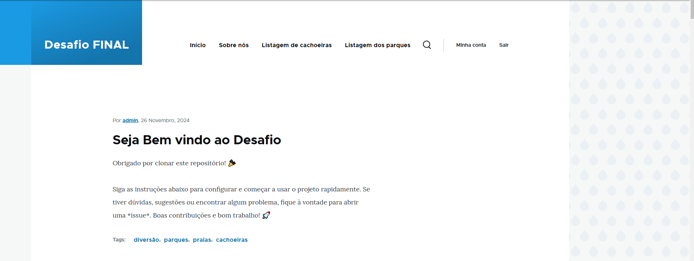

# Projeto Drupal com DDEV
# Nome do projeto: desafio-final

Este projeto utiliza o **DDEV** para o ambiente de desenvolvimento local e o **Drupal** como CMS. Siga as instruções abaixo para configurar e executar o projeto.

## Pré-requisitos

Antes de começar, certifique-se de ter o [DDEV](https://ddev.readthedocs.io/en/latest/) instalado, o [Docker](https://www.docker.com/) configurado e em execução, e acesso ao repositório do projeto no GitHub.

* Servidor web: Apache, Nginx ou outro compatível com PHP
* PHP: Versão recomendada pelo Drupal 11
* Banco de dados: MySQL, PostgreSQL ou outro suportado pelo Drupal 11
* Composer: Gerenciador de dependências do PHP

## Passos para configurar o projeto

1. **Clone o repositório**:  
   Clone o projeto a partir do GitHub e navegue para a pasta do projeto.  
   ```bash
   git clone <https://github.com/DiMedeiros15/projeto-final-bootcamp>
   cd <desafio-final>

2. **Configure o DDEV**:
Na raiz do projeto, inicie o DDEV com o comando:

    ddev config
    Em seguida, inicie o DDEV:
    ddev start

3. **Importe os arquivos do banco de dados**:
Certifique-se de que o arquivo do banco de dados está disponível no projeto (ou solicite ao responsável). Para importar o banco de dados:

    ddev import-db --src=<..database/backup.sql>

4. **Importe os arquivos do site**:
Certifique-se de que o diretório files (geralmente em sites/default/files) está disponível no projeto. Para importar os arquivos:

    ddev import-files --src=<../config/sync>

5. **Execute o Drush para sincronizar a configuração**:
Para importar configurações e sincronizar o estado do site, execute:

    ddev drush cim -y

6. **Limpe o cache**:
Finalize limpando o cache para garantir que o site carregue corretamente:

    ddev drush cr

7. **Acesse o site**:
Após configurar, acesse o site no navegador pelo link fornecido pelo DDEV. Use o comando abaixo para verificar o endereço:
   
    ddev describe
    O link será algo como https://<desafio-final/>.ddev.site.
    ddev launch

## Nesse projeto foi criado

- Blocos de cachoeira e parque de diversão.
- Foi instalado os modulos: (Admin Toolbar, Path-auto, Token, Devel, Drush).
- Categorias (Dificuldades, Localização dos parques, localização das cachoeiras).
- Foram criados: Blocos, pages e exportação rest.

** Depois de executar o drupal launche ira abrir essa pagina no seu navegador:


** Fico a disposição para qualquer duvidas.** 